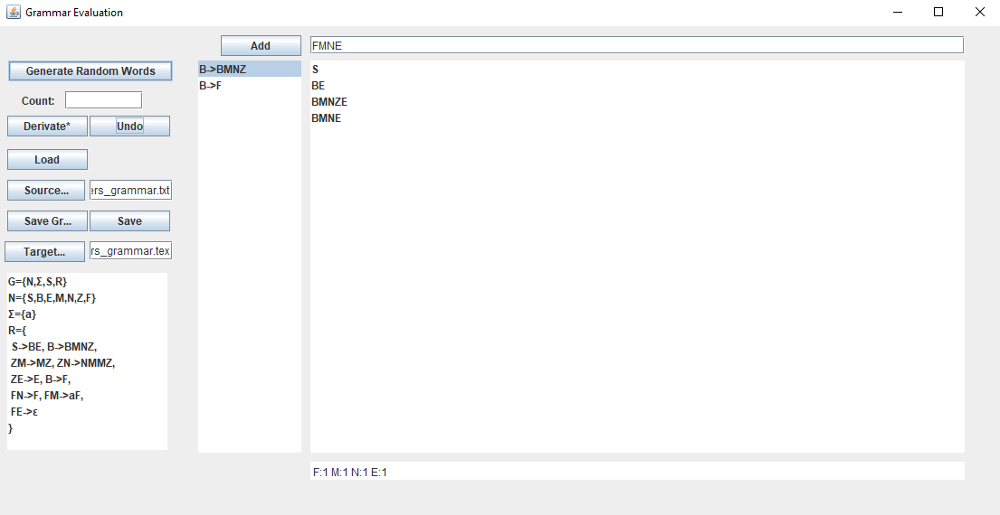
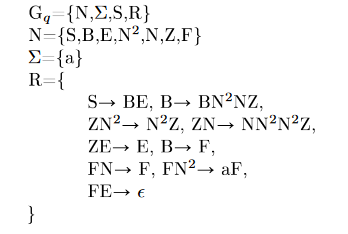

# Evaluation of Context-sensitive grammar

* Loads grammar definition and calculates derivatives
* Exports grammar to PDF
* Requires Java 7
* Sample grammar produces sequences of as
    * with {a^(n^2)| m E N}

